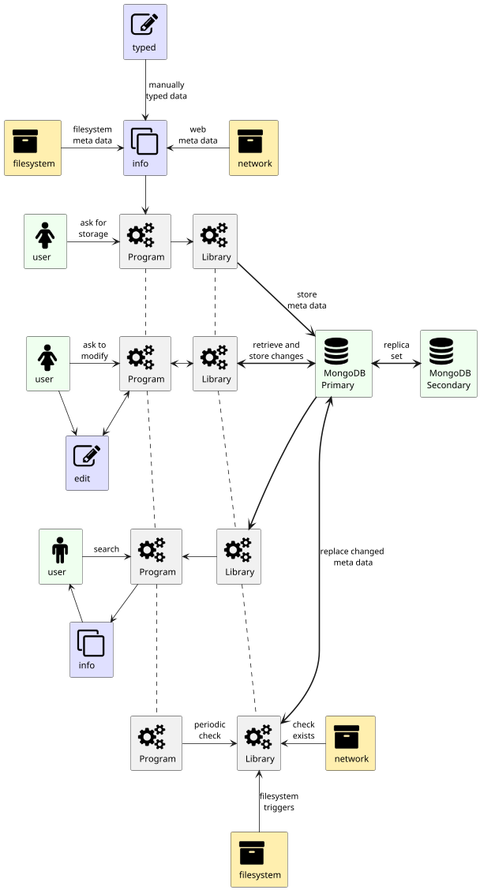

```plantuml
@startuml
scale 0.8

!include <tupadr3/common>
!include <tupadr3/font-awesome/archive>
!include <tupadr3/font-awesome/clone>
!include <tupadr3/font-awesome/cogs>
!include <tupadr3/font-awesome/edit>
!include <tupadr3/font-awesome/female>
!include <tupadr3/font-awesome/male>
!include <tupadr3/font-awesome/database>

'title Define Categories


FA_FEMALE( u1, user) #efffef
FA_COGS( lib1, Library)
FA_COGS( prog1, Program)
FA_DATABASE( db1, MongoDB\nPrimary) #efffef
FA_DATABASE( db2, MongoDB\nSecondary) #efffef
FA_ARCHIVE( fs, filesystem) #ffefaf
FA_ARCHIVE( net, network) #ffefaf
FA_CLONE( fsinfo1, info) #e0e0ff
FA_EDIT( typed, typed) #e0e0ff

u1 -> prog1 : ask for\nstorage
fs -> fsinfo1 : filesystem\nmeta data
typed --> fsinfo1 : manually\ntyped data
fsinfo1 <- net : web\nmeta data
fsinfo1 --> prog1
prog1 -> lib1
lib1 ==> db1 : store\nmeta data
db1 <=> db2 : replica\nset

FA_FEMALE( u2, user) #efffef
FA_COGS( lib2, Library)
FA_COGS( prog2, Program)
FA_EDIT( meta, edit) #e0e0ff


prog1 .. prog2
lib1 .. lib2

u2 -> prog2 : ask to\nmodify
prog2 <-> lib2
prog2 <--> meta
'meta <--> prog2
u2 --> meta
lib2 <=> db1 : retrieve and\nstore changes


FA_MALE( u3, user) #efffef
FA_COGS( lib3, Library)
FA_COGS( prog3, Program)
FA_CLONE( showinfo, info) #e0e0ff

prog2 ... prog3
lib2 ... lib3

u3 -> prog3 :search
prog3 <- lib3
db1 ===> lib3
prog3 --> showinfo
u3 <- showinfo

'FA_FEMALE( u4, user) #efffef
FA_COGS( lib4, Library)
FA_COGS( prog4, Program)
FA_ARCHIVE( fs2, filesystem) #ffefaf
FA_ARCHIVE( net2, network) #ffefaf

prog3 ... prog4
lib3 ... lib4

prog4 -> lib4 : periodic\ncheck

lib4 <-- fs2 : filesystem\ntriggers
lib4 <- net2 : check\nexists
lib4 <====> db1 : replace changed\n meta data
@enduml
```
